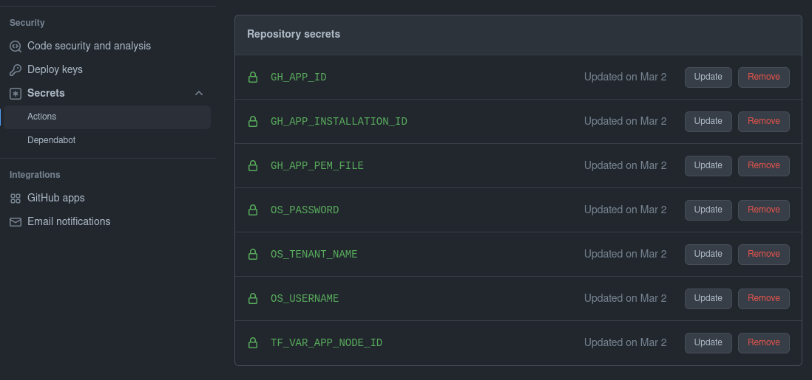

# Managing GitHub organization with OpenTofu

This setup is based on
[hashicorp/learn-terraform-github-actions](https://github.com/hashicorp/learn-terraform-github-actions),
but relies exclusively on GitHub Actions without communicating with Terraform
Cloud.

# 1. Cloning OpenTofu repository

Clone this repository to your GitHub organization and adjust variables to your
liking.

# 2. GitHub App configuration

GitHub App will be used by OpenTofu to provision organization.

## Creating new GitHub App

It can be created by following [this guide](https://docs.github.com/en/developers/apps/building-github-apps/creating-a-github-app).
Application should be limited to only one account. Permissions depend on what
resources you plan to manage with OpenTofu, but a sensible base is:

- Repository/Administration - Read and write
- Repository/Contents - Read and write
- Repository/Metadata - Read-only
- Repository/Projects - Read-only
- Repository/Single file - CODEOWNERS
- Organization/Administration - Read and write
- Organization/Blocking users - Read and write
- Organization/Members - Read and write
- Organization/Projects - Admin

After creating the App, you may need to [install it in
organization](https://docs.github.com/en/developers/apps/managing-github-apps/installing-github-apps).

GitHub App will use [private key](https://docs.github.com/en/developers/apps/building-github-apps/authenticating-with-github-apps)
for authentication. In order to properly authenticate with OpenTofu GitHub
provider you will need:

- GitHub App ID (GitHub Action secret `GH_APP_ID`)
- GitHub App installation ID (GitHub Action secret `GH_APP_INSTALLATION_ID`)
- GitHub App private key in PEM format (GitHub Action secret `GH_APP_PEM_FILE`)

## Getting GitHub App node ID

Node ID is used in GraphQL API. Some OpenTofu resources like
[github_branch_protection](https://search.opentofu.org/provider/hashicorp/github/latest/docs/resources/branch_protection)
may require node IDs for access control lists. Knowing your App node ID will be
handy, when you want to allow some actions only to it. While there may be some
better way of getting the node ID, you can use your newly created App to query
itself for node ID. First, generate [JWT token](https://docs.github.com/en/developers/apps/building-github-apps/authenticating-with-github-apps#authenticating-as-a-github-app)
and then [query /app endpoint](https://docs.github.com/en/rest/reference/apps).

# 3. Configuring state backend

OpenTofu requires a backend to store configuration state. This example repository
uses OpenStack Swift. Consult [OpenTofu documentation](https://opentofu.org/docs/language/settings/backends/configuration/)
and choose your preferred backend. Keep in mind that you will also have to pass
access credentials as GitHub secrets in order to use it.

# 4. Configuring OpenTofu repository secrets

Visit `Repository` -> `Settings` -> `Secrets` -> `Actions` and ensure that at
least the following variables are configured:

- GH_APP_ID
- GH_APP_INSTALLATION_ID
- GH_APP_PEM_FILE
- TF_VAR_APP_NODE_ID
- and secrets required by your backend. Screenshot below uses OpenStack access
  credentials.

# GitHub Actions workflows

Workflows are divided into 3 files:

- `.github/workflows/tofu-checks.yml` - Validates pull request without
  accessing repository secrets.
- `.github/workflows/tofu-plan.yml` - Generates OpenTofu plan. This
  workflow is launched only after a user whitelists in file comments pull request
  with the _/plan_ message. It ensures that untrusted code from pull requests won't
  be run automatically with repository secrets. See [this article](https://securitylab.github.com/research/github-actions-preventing-pwn-requests/)
  for more details.
- `.github/workflows/tofu-apply.yml` - Enforces state after pushing code to
  the main branch.
